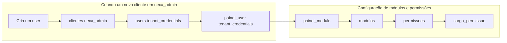

# Permissões e Módulos no Projeto

Este documento descreve como funciona o modelo de **permissões por módulo** no projeto: formato das permissões, proteção de rotas no backend, exibição condicional no sidebar e alinhamento entre rotas e menu.

---

## 1. Visão geral do modelo

- **Formato das permissões**: `recurso.acao` (ex.: `chat.visualizar`, `agenda.criar`, `pacientes.visualizar`).
- **Sidebar**: um item do menu só é exibido se o usuário tiver a permissão correspondente (via `auth.canAll` ou `auth.permissoes`).
- **Rotas**: cada grupo de rotas de um módulo é protegido com `middleware('permissao:recurso.acao')`. Quem não tiver a permissão recebe **403** ao acessar a URL diretamente.

Assim, **o que o usuário vê no menu é exatamente o que ele pode acessar pelas rotas**.

---

## 2. Fluxo: criação de cliente e configuração de módulos e permissões

O fluxo abaixo resume (a) como a criação de um novo cliente em `nexa_admin` impacta as tabelas `clientes`, `users` e `painel_user`, e (b) como a configuração de módulos e permissões liga `painel_user` → `painel_modulo` → `modulos` → `permissoes` → `cargo_permissao`. A tabela `cargo_permissao` é a base das permissões de visualização no front-end.



**Notas:**

- **painel_user**: passa o `id` do user + o `painel_id` da tabela nexa_admin (tipo_painel). Sem FK no banco; relação feita apenas pela model.
- **painel_modulo**: associa `painel_id` do user ao `modulo_id`. Cada painel tem determinados módulos disponíveis para aquele usuário.
- **modulos**: nome do módulo + `display_name` (nome de renderização na view).
- **permissoes**: `nome` (ex.: visualizar, criar, excluir), `recurso` (ex.: chat), `modulo_id`. Ex.: nome: visualizar, recurso: chat, modulo_id: 1.
- **cargo_permissao**: associa `cargo_id` + `permissao_id` (e no projeto, `painel_id`). Ex.: cargo_id: 1 (admin), permissao_id: 1 (editar chat). Esta tabela deve estar bem padronizada, pois é com ela que no front-end se define a visualização permitida para cada cargo.

Diagrama original do board:


---

## 3. Módulos e permissões (Seeder)

Os módulos e permissões são criados pelo **RolePermissaoSeeder** (`database/seeders/RolePermissaoSeeder.php`), no contexto do tenant (credentials).

### 3.1 Módulos cadastrados

| Módulo     | Display Name | Descrição              |
|-----------|--------------|------------------------|
| chat      | Chat         | Módulo de chat         |
| agenda    | Agenda       | Agenda e calendário    |
| imoveis   | Imóveis      | Gestão de imóveis      |
| pacientes | Pacientes    | Cadastro de pacientes  |
| financeiro| Financeiro   | Módulo financeiro      |
| leads     | Leads        | Gestão de leads        |

### 3.2 Ações padrão por recurso

Para cada módulo são criadas as permissões com as ações:

- `visualizar`
- `criar`
- `editar`
- `excluir`

O nome completo fica no formato `recurso.acao` (ex.: `chat.visualizar`, `agenda.criar`).

### 3.3 Associação painel × módulo

No seeder, cada **tipo de painel** (tipo de empresa) tem um conjunto de módulos:

| Tipo de painel    | Módulos disponíveis                    |
|-------------------|----------------------------------------|
| CRM Ecommerce     | chat, agenda, financeiro                |
| CRM Clínica       | chat, agenda, pacientes, financeiro     |
| CRM Imobiliário   | chat, agenda, imoveis, leads, financeiro|

A tabela `painel_modulo` (tenant_credentials) associa `painel_id` (tipo_painel) ao `modulo_id`.

### 3.4 Cargo × permissões por painel

O cargo admin (id 1) pode ser associado a **todas** as permissões em cada painel via `cargo_permissao` (com `painel_id`). Outros cargos podem ter conjuntos restritos de permissões por painel.

---

## 4. Backend: middleware e compartilhamento de dados

### 4.1 Middleware `permissao`

- **Classe**: `App\Http\Middleware\VerificarPermissao`
- **Registro**: em `bootstrap/app.php` como `'permissao' => \App\Http\Middleware\VerificarPermissao::class`
- **Uso nas rotas**: `middleware('permissao:chat.visualizar')` ou `middleware('permissao:agenda.criar')`

Comportamento:

1. Usuário não autenticado → **401**.
2. Usuário **admin master** (cargo_id === 1 e sem empresa_id) → passa sem checar permissão.
3. Caso contrário: obtém o `painel_ativo_id` (session ou tipo da empresa) e chama `$user->temPermissaoNoPainel($permissao, $painelId)`.
4. Sem permissão no painel → **403** (“Sem permissão para esta ação.”).

### 4.2 User: permissões no painel

- **`getPermissoesDoPainel(?int $painelId = null): array`**  
  Retorna a lista de permissões do usuário no painel no formato `["recurso.acao", ...]`.  
  Admin master (cargo 1 sem empresa) retorna `[]`; o front usa `canAll` para exibir tudo.

- **`temPermissaoNoPainel($permissaoNome, $painelId = null): bool`**  
  Verifica se o cargo do usuário tem a permissão (recurso + nome) no painel, via pivot `cargo_permissao` com `painel_id`.

- **`temAcessoAoPainel($painelId)`**  
  Verifica se o usuário acessa aquele painel (empresa com esse tipo_painel ou relação em `painel_user`).

### 4.3 Dados compartilhados com o frontend (Inertia)

Em **HandleInertiaRequests** são compartilhados:

```php
'auth' => [
    'user' => $user,
    'canAll' => $canAll,   // true se cargo_id === 1 e !empresa_id
    'permissoes' => $permissoes,  // array de "recurso.acao" do painel ativo
],
```

- **canAll**: usuário pode tudo (admin master); não precisa checar lista de permissões.
- **permissoes**: lista de strings no formato `recurso.acao` para o painel ativo (ou vazia se canAll).

---

## 5. Frontend: helper e uso no sidebar

### 5.1 Helper `podeVer`

Arquivo: **`resources/js/utils/permissao.ts`**

```ts
export function podeVer(
  permissao: string | undefined,
  auth?: { canAll?: boolean; permissoes?: string[] } | null
): boolean
```

- Se `permissao` for `undefined` ou vazio → retorna `true`.
- Se não houver `auth` → retorna `false`.
- Se `auth.canAll === true` → retorna `true`.
- Caso contrário → retorna `auth.permissoes.includes(permissao)`.

Uso típico: `podeVer('agenda.visualizar', auth)` para exibir ou não o link do Calendário/Agenda.

### 5.2 Uso nas navigations (sidebar)

Cada **navigation** do módulo (Ecommerce, Clínica, Corretor) importa `podeVer` e usa `auth` de `usePage().props.auth`:

- **EcommerceNavigation**: esconde/mostra Calendário com `podeVer('agenda.visualizar', auth)` e Atendimento (Chat) com `podeVer('chat.visualizar', auth)`.
- **ClinicaNavigation**: Calendário e Agendamentos/Consultas com `agenda.visualizar`; Pacientes e Prontuários com `pacientes.visualizar`; Atendimento com `chat.visualizar`.
- **CorretorNavigation**: Calendário com `agenda.visualizar`; Anúncios e Imóveis com `imoveis.visualizar`; Kanban e Leads com `leads.visualizar`; Atendimento com `chat.visualizar`.

Assim, o **mesmo** `recurso.acao` usado no middleware das rotas é usado no front para decidir se o item do menu aparece.

---

## 6. Rotas por tipo de empresa e permissões

Cada arquivo em `routes/modulos/` já está protegido por **tipo de empresa** (`tipo:clinica`, `tipo:corretor`, `tipo:ecommerce`). Dentro deles, os grupos de rotas são protegidos por **permissão**.

### 6.1 Ecommerce (`routes/modulos/ecommerce.php`)

- **Prefixo**: `admin/ecommerce`
- **Middleware de grupo**: `jwt.cookie`, `auth`, `tipo:ecommerce`

| Recurso   | Permissão             | Rotas protegidas                                      |
|-----------|------------------------|--------------------------------------------------------|
| Calendário| `agenda.visualizar`   | calendar (index, events, store, update, destroy, settings, auth, callback, disconnect) |
| Chat      | `chat.visualizar`     | chat (index, conversations, messages, send, mark-read, settings, respostas-rapidas)   |

Dashboard, menu, produtos, clientes, pedidos, config e empresa **não** usam middleware `permissao:*` (acesso controlado apenas por tipo ecommerce).

### 6.2 Clínica (`routes/modulos/clinica.php`)

- **Prefixo**: `admin/clinica`
- **Middleware de grupo**: `jwt.cookie`, `auth`, `tipo:clinica`

| Recurso      | Permissão               | Rotas protegidas |
|--------------|-------------------------|------------------|
| Calendário   | `agenda.visualizar`     | calendar (index, events, store, update, destroy, settings, auth, callback, disconnect) |
| Chat         | `chat.visualizar`       | chat (index, conversations, messages, send, settings, respostas-rapidas) |
| Pacientes    | `pacientes.visualizar`  | pacientes (resource), prontuarios (resource), pacientes.buscar |
| Consultas / Agendamentos | `agenda.visualizar` | consultas (resource + status), agendamentos (resource + status) |

Dashboard e menu não usam middleware de permissão.

### 6.3 Corretor (`routes/modulos/corretor.php`)

- **Prefixo**: `admin/corretor`
- **Middleware de grupo**: `jwt.cookie`, `auth`, `tipo:corretor`

| Recurso   | Permissão             | Rotas protegidas |
|-----------|------------------------|------------------|
| Calendário| `agenda.visualizar`   | calendar (index) |
| Imóveis / Listings | `imoveis.visualizar` | listings (CRUD), imoveis (index, create, store, show, edit, update, destroy, cidades, categorias, autorizacao, planta, video, images, etc.) |
| Chat      | `chat.visualizar`     | chat (index, conversations, messages, send, settings, respostas-rapidas) |
| Leads / Kanban | `leads.visualizar` | kanban (index, update-status, bulk-status, quadros, colunas), leads (index, create, store, update, edit, show, destroy) |

Dashboard, menu e settings não usam middleware de permissão.

---

## 7. Modelo de dados (resumo)

- **Modulo** (tenant_credentials): nome, display_name, descricao.
- **Permissao** (tenant_credentials): nome (acao), recurso (= nome do módulo), modulo_id, display_name. Nome completo para checagem: `recurso.nome` (ex.: `chat.visualizar`).
- **painel_modulo** (tenant_credentials): associa tipo_painel (painel_id) ao modulo_id.
- **cargo_permissao** (tenant_credentials): associa cargo_id, permissao_id e **painel_id** (permissão válida por painel).

O **painel ativo** vem de `session('painel_ativo_id')` ou, na prática, do tipo da empresa do usuário (`empresa.tipo_painel_id`).

---

## 8. Resumo prático

1. **Adicionar nova área protegida por permissão**
   - Garantir que exista o módulo e a permissão no seeder (ex.: `produtos.visualizar`).
   - Agrupar as rotas em `Route::middleware(['permissao:produtos.visualizar'])->group(...)`.
   - No sidebar, usar `v-if="podeVer('produtos.visualizar', auth)"` no link correspondente.

2. **Admin master (cargo 1, sem empresa)**  
   Não passa por checagem de permissão no middleware e no front tem `canAll === true`; vê todos os itens e acessa todas as rotas protegidas por permissão.

3. **Consistência**  
   Sempre usar o **mesmo** `recurso.acao` na rota (middleware) e no sidebar (`podeVer`), para o menu refletir exatamente o que as rotas permitem.
